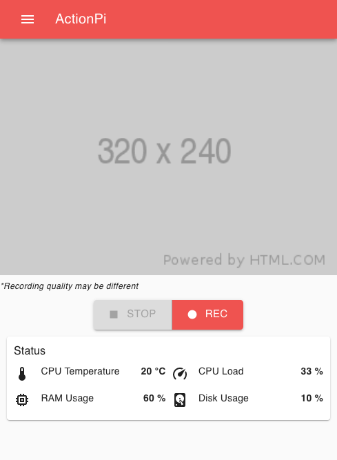
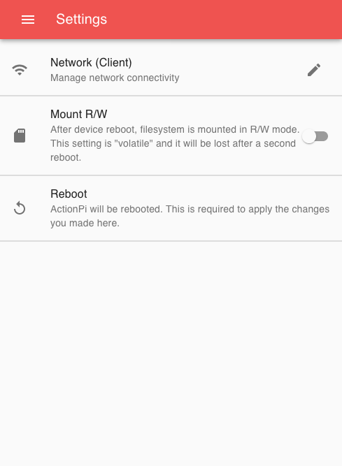
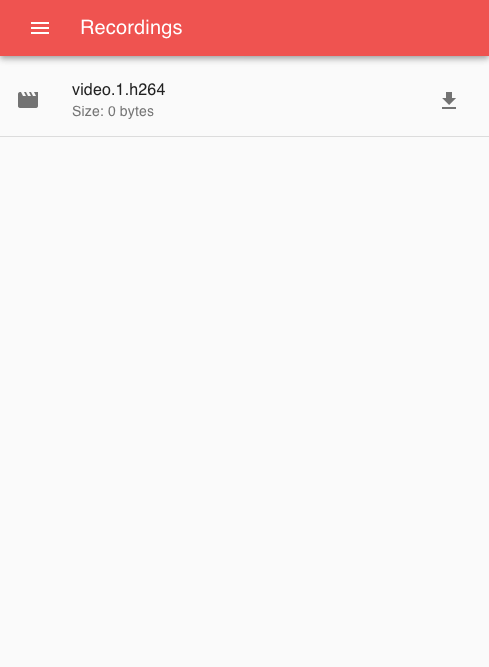
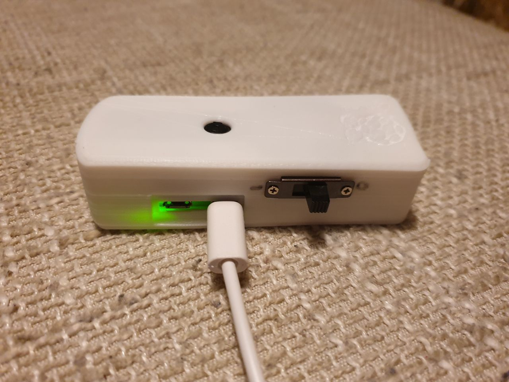
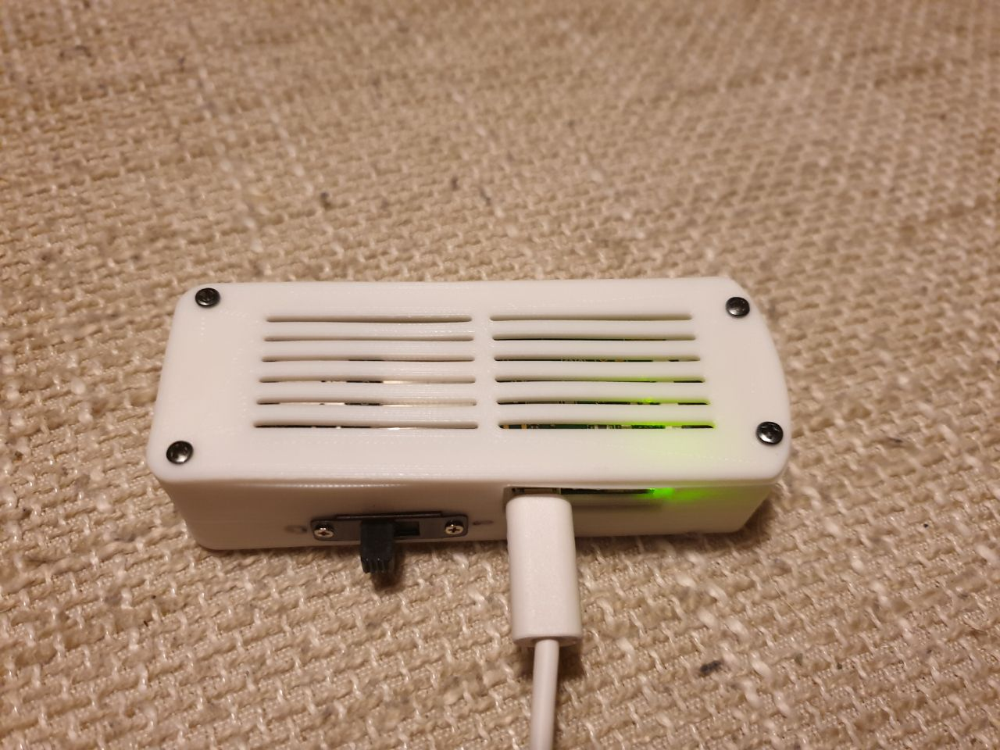
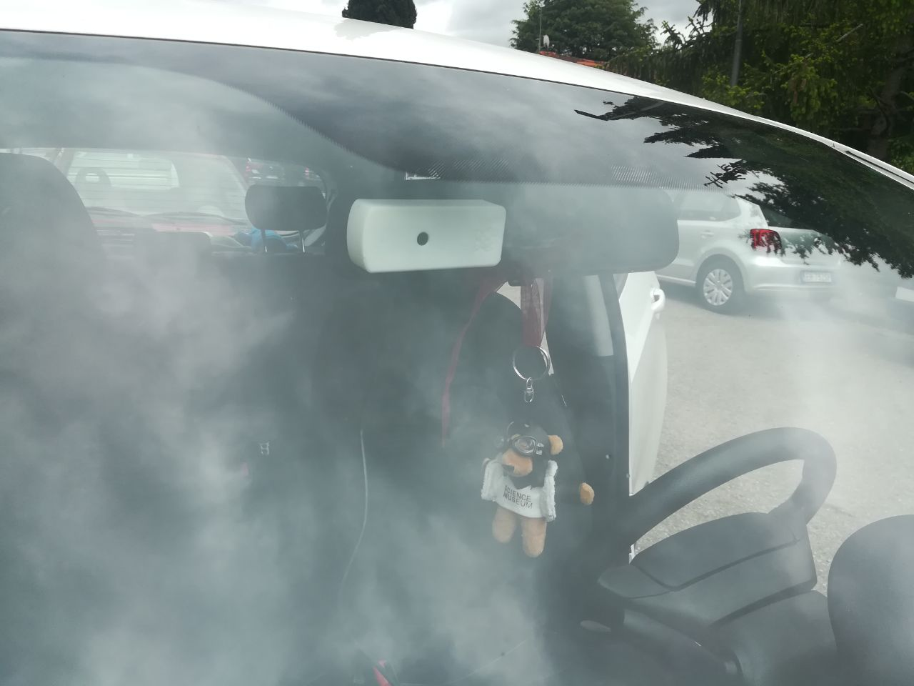
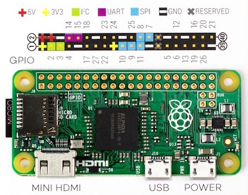

# ActionPi [WIP]

  

Action/Dash camera powered by Raspberry Pi Zero 

# ✨ Features 

 - 📽 **FullHD** video recordings
 - 📥 **Download video** easily using USB cable or WiFi connection
 - 💡 **Rolling video appenders**: record video in a circular buffer, never overwrite on reboot
 - 🔨 **Robust design**: temperature control, OS read-only partition & low latency write-to-disk (never miss a single frame on power loss)

# Index
 
 - [Introduction]()
 - [Getting Started]()
    - [Bill of Materials]()
    - [Write SD Card Image]()
    - [Print 3D Case]()
    - [Wrap Up]()
 - [WiFi Setup]()
    - [Hotspot]()
    - [Client]()
 - [Web Interface]()
 - [Advanced]()
    - [Serial Access]()
    - [Postman API]()
 - [Known Issues/Limitations]()
 - [Pinout]()
 - [F.A.Q.]()
    
## Introduction
ActionPi is a DIY project that gives everyone the opportunity to build an action/dash camera with a _20$_ budget.

## Getting Started
Follow the next steps in order to setup a new ActionPi board.

### Bill of Material

 1. 1x RaspberryPi Zero/Zero W
 1. 1x SD Card (at least 4 GB)
 1. 1x RaspberryPi Camera Module + Camera flat connector
 1. 1x Heatsink (1,5x1,5x0,5)cm
 1. 8x Screw
 1. 1x Nut
 1. 1x 3D-printed case
 
### Write SD Card Image

Althought there is the opportunity to setup an ActionPi starting from a pure Raspbian image I've uploaded an handy prebuild image:
 - [ActionPi-Raspbian](?)

As stated before this is a standard Raspbian image that comes with all the requried ActionPi configurations and could be written following the official Raspberry Pi guide from [here](?).

**Note**: prebuilt image has three partitions already configured and mounted by default in the following directories:

  - `boot` (FAT-32): contains the boot files needed to launch Raspbian
  - `/media/recrodings` (FAT-32): is the partition where the recordings will be written
  - `/` (EXT3): this is the read-only partition that contains the Raspbian OS data

### Print 3D Case

You'll find all the required STL files on [Thingiverse](?).

### Wrap Up

## WiFi Setup
For Raspberry Pi Zero W, WiFi could operate in **Client** or **Hotspot** mode. 

### Hotspot
Hotspot mode enables ActionPi to act as an Access Point (AP) and allow devices to connect directly to it. In this mode **no Internet connection is available** but you can access the web interface here: `http://192.168.4.1` or `http://actionpi.local`. The AP will spawn with following parameters:

 - SSID: _ActionPi_
 - Password: actionpi (_default_)
 
 If you want to switch to _Hotspot_ mode you could enable it from web interface or by running: `sudo echo "SuperSecretPasswordHere" > /boot/wifi_hotspot`

### Client
On _Client_ mode ActionPi will try to connect to a predefined network.

Client mode could enabled from web interface or by running 

## Web Interface

[ActionPi-UI](https://github.com/andreacioni/actionpi-ui) is the web interface packed inside ActionPi. With this simple UI you could do some usefull actions like: 

  - **Download recrodings**
  - **WiFi settings**
  - View **live recording preview**
  - **Monitor** board status

Here some screenshots:

  
  
  

## Advanced

### How to access ActionPi system
There are many ways available, by default, to get access to ActionPi through command line interface.

 - **SSH**: Secure Shell is available on every network interface, here below the most common and ready-to-use
    - **USB**: USB Host port expose a network interface that allows to connect ActionPi directly using only a simple USB Micro cable
    - **WiFi**: Either if you are using Hotspot or Client mode
 - **Serial**: UART0 (GPIO 14 & 15) is enabled on ActionPi prebuilt image. In order to access serial port you need a Serial-to-USB cable.
 - **HDMI + USB Keyboard**: plug a keyboard and the HDMI cable and you can gain the access to the ActionPi CLI. _Desktop NOT available_

## Photos

This is the prototype I've built:

  
  
  

## Do you want to build it on your own and/or contribute?

I'm currently looking for someome interested in build a prototype for personal usage and also help me in the documentation phase of this project.

### Convert h264 video
In order to play the video you have to run: `mp4box -add video.h264:fps=<framerate>  -new video.mp4` 

### Enable WiFi Client
`sudo touch /boot/wifi_client`

### Enable WiFi hotspot
`sudo touch /boot/wifi_hotspot`

### Start Read/Write mode
`sudo touch /boot/rw` or place a jumper between GPIO 21 and GND

## Pinout

